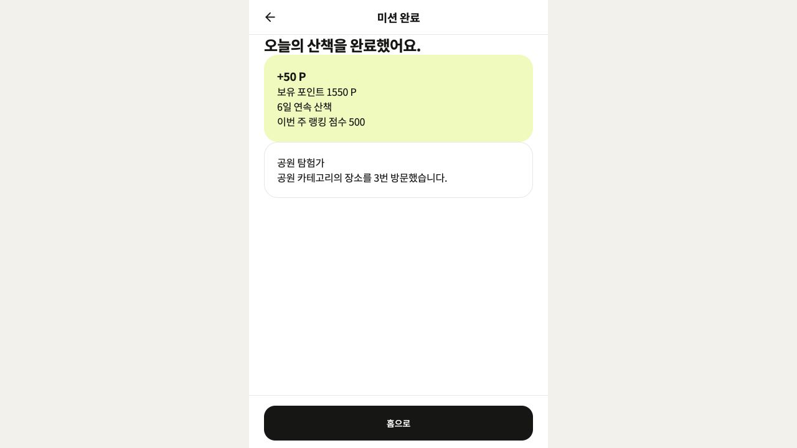
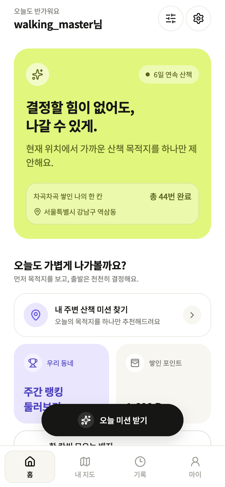
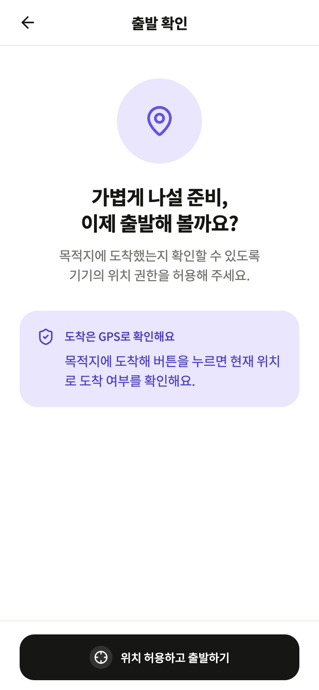
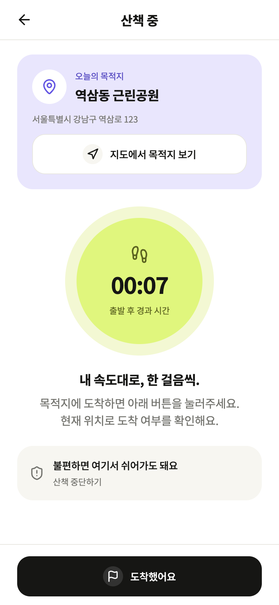
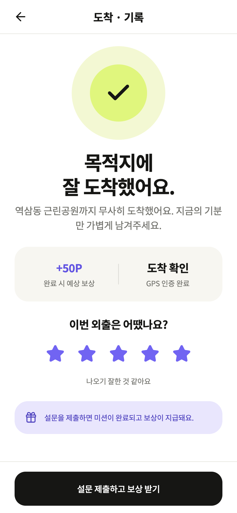
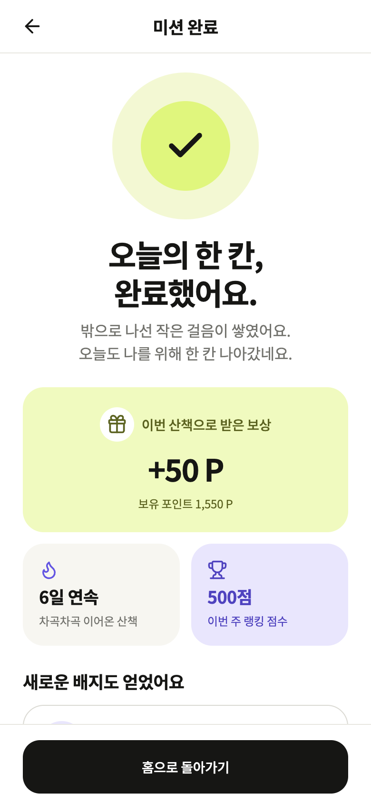

# API 연동 후 UI 회귀 수정

## 원인과 범위

API 연결 작업에서 기존 화면의 시각 구조를 제거하면서 완료 화면이 제목·문자 목록에 가까워졌습니다. 이번 실행에서 동일한 완료 상태를 새로 캡처해 확인했고, 기존 컴포넌트/색상/간격 토큰에 맞춰 네 화면을 복구했습니다. API 요청·인증·서버 응답 형식은 유지합니다.

이번 실행에서 확인한 수정 전 완료 화면 (1280×720):

## 확인한 단계

1. **홈 — 복구 확인.** 히어로 카드, 아이콘, 포인트/랭킹 카드, 둥근 플로팅 버튼 복구. 긴 닉네임은 인사 문구와 분리하고 버튼 영역을 침범하지 않도록 제한합니다. 실데이터의 스트릭·완료 수·포인트를 표시합니다.
2. **출발 — 복구 확인.** 위치 아이콘, 중앙 제목, 안내 카드로 정보 구분. 기존 위치 허용과 start 요청은 유지합니다.
3. **이동 — 복구 확인.** 목적지 카드, 실제 출발 시각 기반 타이머, 중단 안내 카드로 정리. 가상의 실시간 경로나 진행률을 추가하지 않습니다. arrive 요청과 화면 전환을 검증했습니다.
4. **설문 — 복구 확인.** 완료 아이콘·별점 선택·예상 보상·GPS 확인 상태 복구. 4점 선택 후 제출하여 기존 API의 afterSurveyScore를 사용하는 흐름을 검증했습니다.
5. **완료 — 복구 확인.** 완료 메시지, 실제 지급 포인트, 스트릭/랭킹 카드와 새 배지를 분리. 성공 화면 전환 때 스크롤 컨테이너를 재생성해 상단의 완료 아이콘부터 보이도록 수정했습니다.

## 검증 및 한계

- 브라우저 MSW로 추천 → 출발 → 도착 → 4점 설문 → 보상 표시 → 홈 포인트/완료 수 갱신을 반복 검증했습니다.
- 390×844에서 시각적 간격과 버튼 배치를 검증했습니다. 320×568 완료 화면에서는 수평 넘침 없음, 뒤로 44×44 및 주요 버튼 272×56 크기, 하단 배지까지 스크롤 접근을 확인했습니다.
- 타입 검사, 린트, 기존 API 테스트 5개(986 assertions) 통과.
- 스크린리더, 시스템 글자 확대, 실제 iOS/Android 화면, 전체 WCAG 적합성은 이번에 검증하지 않았습니다. 실제 백엔드는 없는 상태이며 API 통신 검증은 MSW 기준입니다.
- 최초 홈 캡처와 데스크톱 수정 후 캡처는 도구의 배율/잘림 문제로 폐기했습니다. 최종 모바일 캡처는 2배 픽셀 비율과 명시적 캡처 영역으로 저장하고 직접 확인했습니다.
